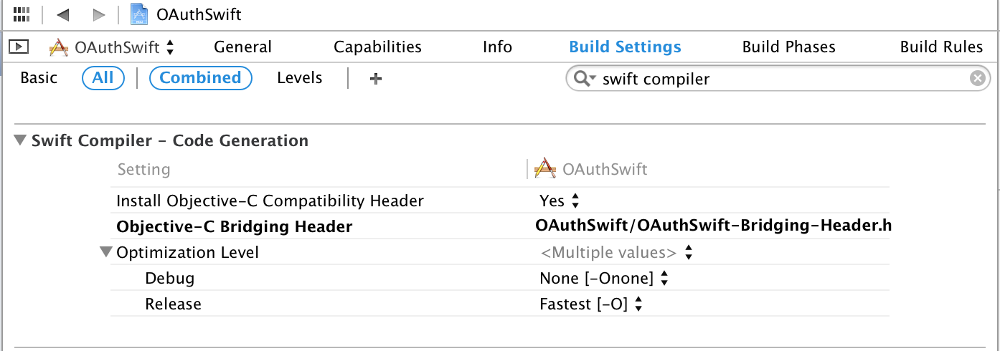
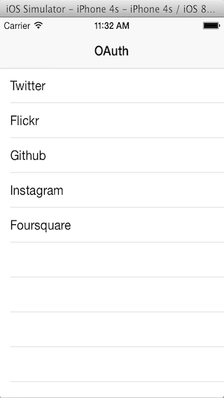
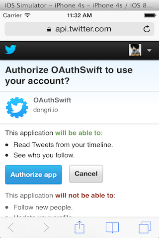
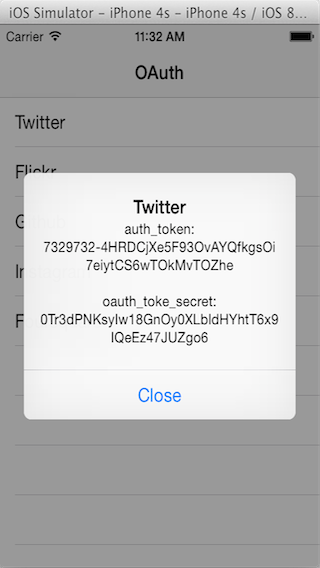

OAuthSwift
==========

Swift based OAuth library for iOS

### Support OAuth1.0, OAuth2.0 

Twitter, Flickr, Github, Instagram, Foursquare. Fitbit, Withings, Linkedin etc

### OAuth pages

[Twitter](https://dev.twitter.com/docs/auth/oauth)  
[Flickr](https://www.flickr.com/services/api/auth.oauth.html)  
[Github](https://developer.github.com/v3/oauth)  
[Instagram](http://instagram.com/developer/authentication)  
[Foursquare](https://developer.foursquare.com/overview/auth)  
[Fitbit](https://wiki.fitbit.com/display/API/OAuth+Authentication+in+the+Fitbit+API)  
[Withings](http://oauth.withings.com/api)  
[Linkedin](https://developer.linkedin.com/documents/authentication)  

### Examples

```
// OAuth1.0
let oauthswift = OAuth1Swift(
    consumerKey:    "********",
    consumerSecret: "********",
    requestTokenUrl: "https://api.twitter.com/oauth/request_token",
    authorizeUrl:    "https://api.twitter.com/oauth/authorize",
    accessTokenUrl:  "https://api.twitter.com/oauth/access_token"
)
oauthswift.authorizeWithCallbackURL( NSURL(string: "oauth-swift://oauth-callback/twitter"), success: {
    credential, response in
    println(credential.oauth_token)
    println(credential.oauth_token_secret)
}, failure: failureHandler)

// OAuth2.0
let oauthswift = OAuth2Swift(
    consumerKey:    "********",
    consumerSecret: "********",
    authorizeUrl:   "https://api.instagram.com/oauth/authorize",
    responseType:   "token"
)
oauthswift.authorizeWithCallbackURL( NSURL(string: "oauth-swift://oauth-callback/instagram"), scope: "likes+comments", state:"INSTAGRAM", success: {
    credential, response in
    println(credential.oauth_token)
}, failure: failureHandler)

```

### Setting Swift Compiler



### Setting URL Schemes


### Images




